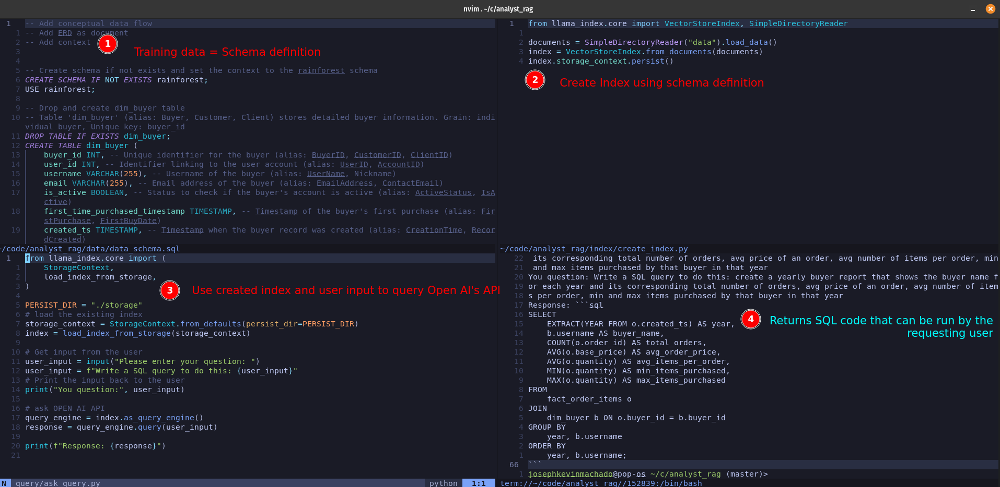

Code for blog at: WIP




```python
# Querying

join_query_str = "for every seller, show me a monthly report of the number of unique products that they sold, avg cost per product, max/min value of product purchased that month"
query_str = "show me for each buyers what date they made their first purchase"
## Retrieve
retriever = index.as_retriever()
nodes = retriever.retrieve(query_str)
## We have a set of nodes, which are found using LLM

## Node postprocessor
## There are multiple: https://docs.llamaindex.ai/en/stable/module_guides/querying/node_postprocessors/node_postprocessors/#node-postprocessor-modules
## Explain time based, similarity based, LLM to process nodes
from llama_index.core.postprocessor import SimilarityPostprocessor
processor = SimilarityPostprocessor(similarity_cutoff=0.70)
filtered_nodes = processor.postprocess_nodes(nodes)
# we only see one filtered node, the node that has the definition of dim_buyer

## Response synthesizer
## Prompt + processed nodes + user query => LLM call
## Prompt
query_engine = index.as_query_engine()
response = query_engine.query(query_str)

query_engine = index.as_query_engine()
response = query_engine.query(join_query_str)
# Try refine response synthesizer
from llama_index.core.response_synthesizers import ResponseMode
from llama_index.core import get_response_synthesizer

response_synthesizer = get_response_synthesizer(
    response_mode=ResponseMode.REFINE
)
response = response_synthesizer.synthesize(
    query_str, filtered_nodes
)

# or alternatively we can run this as query engine function which has sensible defaults
query_engine = index.as_query_engine()
response = query_engine.query(join_query_str)
```

Next steps

1. Split document into individual DDL nodes
2. Add metadata with table and metric aliases

TL;DR: Ways to get more relevant and specific information to the LLM API